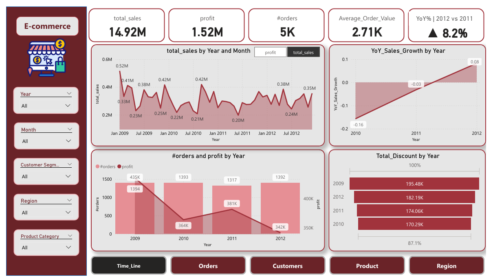
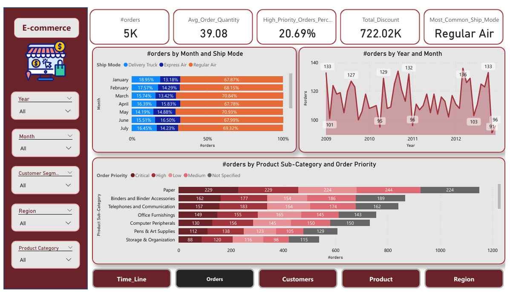
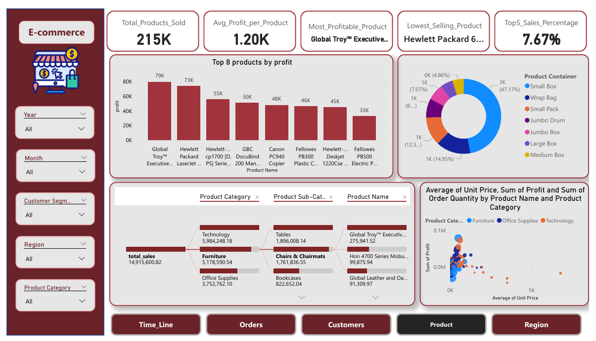
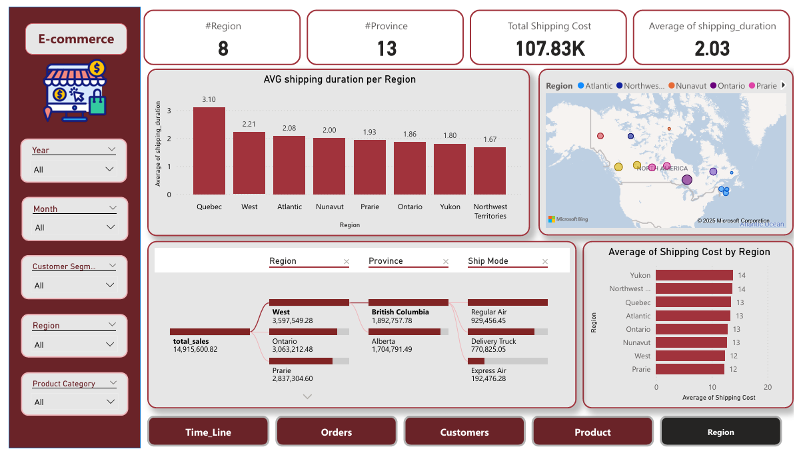

# E-Commerce Sales Analysis Dashboard

## Overview
This Power BI dashboard provides a comprehensive analysis of E-commerce sales data spanning four years (2009-2012). It visualizes key performance indicators (KPIs), trends, and insights across orders, customers, products, and regions. The dataset is structured in 4 Excel sheets, one for each year, covering metrics like total sales, profit, orders, customer segments, and more.

Key Highlights:
- **Total Sales**: 14.92M
- **Profit**: 1.52M
- **# Orders**: 5K
- **Average Order Value**: 2.71K
- **YoY Sales Growth**: ▲8.2%

The dashboard is interactive, allowing users to filter by Year, Month, Customer Segment, Region, and Product Category.

## Data Source
- **Dataset**: 4 Excel sheets (one per year: 2009.xlsx, 2010.xlsx, 2011.xlsx, 2012.xlsx).
- **Columns**: Row ID, Order ID, Order Date, Order Priority, Order Quantity, Sales, Discount, Ship Mode, Profit, Unit Price, Shipping Cost, Customer Name, Province, Region, Customer Segment, Product Category, Product Sub-Category, Product Name, Product Container, Product Base Margin, Ship Date.
- **Sample Data** (first few rows):
  | Row ID | Order ID | Order Date | Order Priority | Order Quantity | Sales | Discount | Ship Mode | Profit | Unit Price | Shipping Cost | Customer Name | Province | Region | Customer Segment | Product Category | Product Sub-Category | Product Name | Product Container | Product Base Margin | Ship Date |
  |--------|----------|------------|----------------|----------------|-------|----------|-----------|--------|------------|---------------|----------------|----------|--------|-------------------|------------------|----------------------|--------------|--------------------|---------------------|-----------|
  | 161 | 998 | 40142 | Not Specified | 16 | 248.26 | 0.07 | Regular Air | 93.8 | 15.74 | 1.39 | Allen Rosenblatt | Nunavut | Nunavut | Small Business | Office Supplies | Envelopes | #10-4 1/8" x 9 1/2" Premium Diagonal Seam Envelopes | Small Box | 0.4 | 40143 |
  | 413 | 2791 | 40095 | High | 47 | 191.67 | 0 | Regular Air | -236.2675 | 3.89 | 7.01 | Eugene Barchas | Nunavut | Nunavut | Corporate | Office Supplies | Binders and Binder Accessories | Avery Binder Labels | Small Box | 0.37 | 40095 |
  | 414 | 2791 | 40095 | High | 49 | 5586.33 | 0.09 | Delivery Truck | 80.44 | 120.98 | 30 | Eugene Barchas | Nunavut | Nunavut | Corporate | Furniture | Chairs & Chairmats | Hon Every-Day® Chair Series Swivel Task Chairs | Jumbo Drum | 0.64 | 40097 |
  | 415 | 2791 | 40095 | High | 18 | 507.64 | 0.1 | Regular Air | 118.94 | 30.98 | 5.76 | Eugene Barchas | Nunavut | Nunavut | Corporate | Office Supplies | Paper | IBM Multi-Purpose Copy Paper, 8 1/2 x 11", Case | Small Box | 0.4 | 40096 |
  | 

- **Total Records**: ~5K orders across all years.
- **Data Prep**: Data was cleaned and loaded into Power BI for DAX measures and relationships.

## Dashboard Screenshots
Here are the key views from the Power BI dashboard. Replace the placeholders below with actual image paths (e.g., `images/screenshot1.png`) when uploading to GitHub.

### 1. Overview & Time Series (Years and Months)

### 2. Orders Analysis

### 3. Customers Analysis

### 4. Products Analysis

### 5. Regions Analysis

## Key Insights
### Orders
- Total Orders: 5K
- Avg Order Quantity: 39.08
- High Priority Orders: 20.69%
- Total Discount: 722.02K
- Most Common Ship Mode: Regular Air
- Trends: Orders peaked in 2011 (1,393), with fluctuations by month and sub-category (e.g., Paper leads in Critical priority).

### Customers
- Total Customers: 795
- Avg Profit per Customer: 1.91K
- Avg Orders per Customer: 6.91
- Top Customer: Emily Phan (117,124.44 sales, 34,005.45 profit)
- Segments: Corporate (35.69%, 5.5M sales) > Home Office (24.87%, 3.6M) > Consumer (19.92%, 3.1M) > Small Business (19.51%, 2.8M).

### Products
- Total Products Sold: 215K
- Avg Profit per Product: 1.20K
- Most Profitable: Global Troy™ Executive Leather Office Chair (79K profit)
- Lowest Selling: Hewlett Packard 6... (not specified in detail)
- Top 5 Sales %: 7.67%
- Categories: Technology (5.98M sales) > Furniture (5.18M) > Office Supplies (3.75M).

### Regions
- # Regions: 8
- # Provinces: 13
- Total Shipping Cost: 107.83K
- Avg Shipping Duration: 2.03 days
- Top Sales Region: West (3.60M)
- Shipping: Quebec has highest avg duration (3.10 days); Yukon highest avg cost (14).

## How to Run
1. **Prerequisites**: Install Power BI Desktop (free from Microsoft).
2. **Load Data**:
   - Open Power BI Desktop.
   - Get Data > Excel > Select the data file (combine sheets if needed).
   - Create relationships between tables (e.g., Order ID, Date).
3. **Import Dashboard**:
   - If .pbix available: File > Open > Select the Power BI file.
   - Otherwise, recreate visuals using the provided screenshots as reference.
4. **Explore**:
   - Use slicers for Year, Month, Segment, Region, Category.
   - Refresh data for updates.
5. **Publish (Optional)**: Publish to Power BI Service for sharing (requires account).
